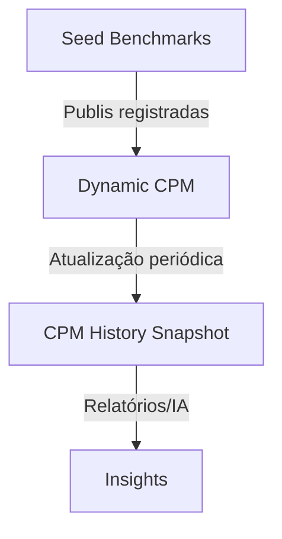

# Ciclo de Vida do CPM – Data2Content

## Visão Geral

O sistema de precificação da Calculadora de Publi opera em duas fases:

1. **Seed benchmark** – utiliza valores de CPM pré-definidos (`INITIAL_CPM_SEED`) quando ainda não existem publis registradas.
2. **Dynamic CPM** – migra automaticamente assim que a comunidade começa a registrar cálculos e negócios reais, calculando médias ponderadas (60% cálculos, 40% deals).

## Fluxo Simplificado



## Logs e Eventos Importantes

| Tag | Quando ocorre | Observação |
| --- | --- | --- |
| `[CPM_SEED]` | Serviço usa o benchmark inicial | Emite apenas enquanto seed estiver ativo |
| `[CPM_MONITOR]` | Percentual de uso de seed cai abaixo de 20% | Endpoint `/api/admin/seed-usage` |
| `[CPM_DYNAMIC_READY]` | Base atingiu massa crítica (`calc + deals > 50`) | Marca a transição para dinâmico |
| `[PRICING_INSIGHT]` | IA responde ao usuário | Inclui origem (`seed` ou `dynamic`) |
| `[CPM_SEED_UPDATE]` | Script gera novo seed | Cria arquivo em `data/seed-history/` |
| `[CPM_HISTORY_SNAPSHOT]` | Snapshot semanal salvo | Via `/api/admin/cpm-history/snapshot` |

## Endpoints Administrativos

- `GET /api/admin/seed-usage`  
  Retorna totais e percentual de cálculos que ainda usam seed vs dynamic.

- `POST /api/admin/cpm-history/snapshot`  
  Salva um snapshot do CPM atual (por segmento) na coleção `CpmHistory`.

- `GET /api/admin/cpm-history?segment=moda&limit=20&page=1`  
  Consulta o histórico de evolução do CPM por segmento.

## Script de Atualização do Seed

O script gera uma nova proposta de `INITIAL_CPM_SEED` a partir dos dados reais:

```bash
npm run update:cpm-seed
```

O comando:

1. Conecta ao MongoDB.
2. Gera um mapa com os CPMs dinâmicos atuais.
3. Salva o JSON em `data/seed-history/seed-YYYY-MM-DD.json`.
4. Imprime o mapa no `stdout` (para copiar em `initialCpmSeed.ts`).

## Dicas Operacionais

- **Monitoramento contínuo:** acompanhe `/api/admin/seed-usage` até que o percentual seed fique abaixo de 20% (indicará adoção quase total dos dados reais).
- **Atualização periódica do seed:** após um volume representativo de campanhas, execute o script para recalibrar o benchmark.
- **Histórico e relatórios:** use o endpoint de histórico para gerar gráficos ou alimentar análises internas/IA.
