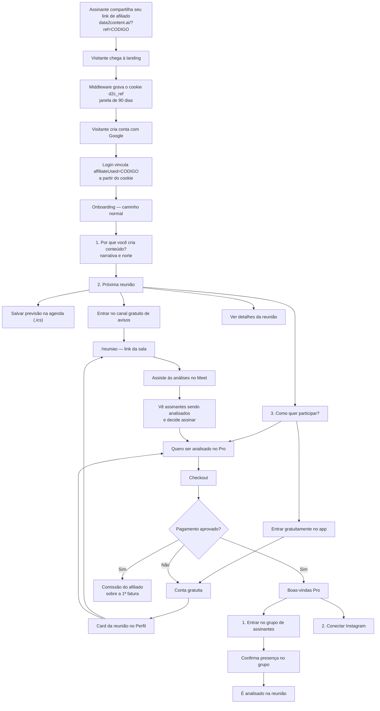

# Funil da reunião — Data2Content

Documento de referência do caminho completo, do convite ao pagamento e à comissão do afiliado.
Complementa o contrato da oferta (`landing-fase-0-oferta.md`) e o registro de implementação
(`landing-fase-2-reuniao.md`).

## A reunião

**Reunião D2C // RaioX de Conteúdo** — quinta-feira, 19h–21h (`America/Sao_Paulo`), Google Meet.

O link da sala nunca é embutido no arquivo de calendário nem exposto publicamente: ele é servido
na página autenticada `/reuniao` e publicado no WhatsApp. A fonte do link, em ordem de precedência:

1. `joinUrl` do próximo `CommunityEvent` agendado (`type=mentorship`);
2. variável server-only `WEEKLY_MEETING_JOIN_URL`;
3. sem nenhuma das duas, a interface diz que o link será liberado — nunca inventa um destino.

O horário é sempre apresentado como **previsão**. O app nunca declara "ao vivo" pelo relógio;
mudanças e cancelamentos são comunicados primeiro pelo WhatsApp.

## O caminho completo

## As três verdades do funil

**O app é o acesso permanente.** `/reuniao` sempre existe para a conta, com o link vigente, a
agenda e a explicação de quem pode o quê. O card no Perfil — entre a calculadora e o "Seu Mapa" —
é o ponto de descoberta recorrente.

**O WhatsApp é a verdade operacional.** O canal gratuito serve os visitantes; o grupo Pro serve os
assinantes e é onde a presença é confirmada. Qualquer mudança de horário ou cancelamento aparece
primeiro ali, porque o app pode não ser atualizado a tempo.

**A agenda é só um lembrete.** O `.ics` marca a previsão de quinta, 19h–21h, aponta para
`/reuniao` e avisa que a reunião pode mudar. Edição cancelada vira `CANCELLED`; sem confirmação
operacional, o evento é `TENTATIVE`.

## Gratuito × Pro

| | Visitante | D2C Pro |
|---|---|---|
| Assistir à reunião | Sim, sempre | Sim |
| Salvar na agenda | Sim | Sim |
| Avisos no WhatsApp | Canal gratuito | Grupo de assinantes |
| Confirmar presença | Não | Sim, no grupo |
| Ser analisado | Não | Sim, quando confirma |
| Conectar Instagram | Não | Sim, após o pagamento |
| Mapa, pautas, collabs, calculadora, mídia kit | Não | Sim |

Preço: R$ 97/mês (ou R$ 890/ano).

## O motor de aquisição

O assinante compartilha o próprio link de afiliado para levar gente à reunião. O convite não
vende a assinatura — vende assistir. A conversão acontece dentro da sala, quando o visitante vê
outros criadores sendo analisados e quer o mesmo para si.

A atribuição é resolvida assim:

1. `?ref=CODIGO` (ou `?aff=`) em qualquer página → o middleware valida o formato e grava o cookie
   `d2c_ref`, com janela padrão de 90 dias.
2. No login, o `signIn` grava `affiliateUsed` na conta, desde que o código pertença a um afiliado
   ativo, diferente do próprio usuário, e a conta ainda não tenha atribuição.
3. A atribuição original é preservada: aplicar outro código depois não transfere a comissão.
4. A comissão incide sobre a primeira fatura paga.

Como a atribuição acontece no login e não depende da página de destino, ela sobrevive a qualquer
mudança de rota do funil.

## Regras que o produto precisa respeitar

- Quem cria conta passa pelo onboarding — é onde a narrativa é respondida e a reunião é
  apresentada. Os CTAs da landing levam todo mundo ao Perfil: o visitante novo cai no onboarding,
  e quem já tem conta encontra o card da reunião com data, WhatsApp e acesso.
- `/reuniao` deixa de ser destino de entrada e passa a ser a página de aprofundamento, alcançada
  pelo card do Perfil, pela sidebar e pela área de Comunidade.
- Nenhuma tela de conexão do Instagram aparece sem pagamento confirmado no servidor.
- Depois do pagamento, o grupo vem antes do Instagram: é lá que a presença é confirmada.
- O visitante nunca é levado ao grupo de assinantes; o canal gratuito é separado.
- A plataforma não registra confirmação de presença — isso é do grupo.

## Pendências operacionais

- Cadastrar o `CommunityEvent` da próxima edição com o `joinUrl` do Meet, ou definir
  `WEEKLY_MEETING_JOIN_URL` na Vercel (sem o prefixo `NEXT_PUBLIC_`).
- Conferir `NEXT_PUBLIC_COMMUNITY_FREE_URL` e `NEXT_PUBLIC_COMMUNITY_VIP_URL` na Vercel.
- Instrumentar o funil ponta a ponta (fase de métricas ainda não executada).
