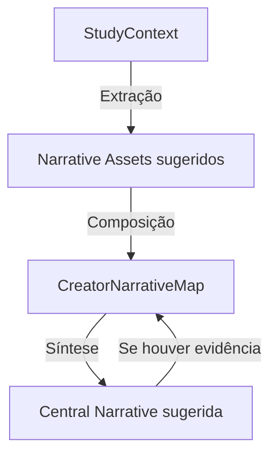

# DNA Narrativo do Criador

Este módulo é responsável por identificar, extrair e sintetizar os blocos fundamentais da narrativa de um criador de conteúdo. 

## Tese de Produto

A Data2Content não é apenas uma IA para gerar pautas; ela é uma plataforma que descobre o **DNA Narrativo** do criador. Através da interpretação de dados e sinais, transformamos a ansiedade criativa em direção estratégica.

> "Não é sobre postar mais. É sobre entender que história o criador está construindo."

Nem todo post precisa viralizar. Todo post precisa ter uma **função estratégica** dentro de uma narrativa maior.

## Arquitetura do Módulo

O sistema é composto por módulos puros e determinísticos:

- **`postCreationNarrativeAssets.ts`**: Define os contratos e tipos fundamentais (`CreatorNarrativeAsset`, `CreatorNarrativeMap`, `CreatorCentralNarrative`, etc.).
- **`postCreationNarrativeAssetsFromStudyContext.ts`**: Extrator determinístico que deriva ativos sugeridos (temas, cenários, linguagens) a partir do `StudyContext`.
- **`postCreationCentralNarrative.ts`**: Sintetiza uma hipótese conservadora de narrativa central quando há densidade de evidências suficiente.
- **`postCreationNarrativeMapBuilder.ts`**: Orquestrador oficial que combina extração e síntese para entregar um `CreatorNarrativeMap` completo.

## Guardrails e Segurança

Para manter a integridade e a confiança do criador, seguimos diretrizes rígidas nesta fase:

1. **Estado Sugerido**: Todos os ativos e narrativas gerados são `suggested`. O sistema nunca afirma verdades absolutas sem confirmação do criador.
2. **Ativos Sensíveis**: Ativos do tipo `personal` e `relationship` são sensíveis por padrão e não são utilizados na síntese automática da frase narrativa central.
3. **Linguagem Não-Determinística**: Evitamos afirmações definitivas. Termos como "comprovado", "garantido", "certeza", "sua narrativa é" ou "sua identidade é" são proibidos nos statements gerados.
4. **Pureza Técnica**: Nesta fase inicial, não há persistência em banco de dados ou chamadas de OpenAI. O módulo de lógica é 100% focado em lógica de negócio pura e testável, consumido por componentes de UI desacoplados.
5. **Segurança Visual**: O componente de visualização (`PostCreationNarrativeMapCard`) replica os guardrails de segurança, filtrando ativos sensíveis e bloqueando termos proibidos antes da exibição ao usuário final.

## Fluxo de Integração (Fase N5)

O DNA Narrativo está integrado ao **Board de Criação Adaptativo**:
1. O `PostCreationAdaptiveNativeFlow` calcula o `NarrativeMap` via `useMemo` a partir do `StudyContext`.
2. O dado é propagado no payload de conclusão do quiz.
3. A tela final do board exibe o card **"Leitura narrativa sugerida"** como um bloco de diagnóstico estratégico.

## Fluxo Conceitual

## Exemplo de Síntese

**Sinais extraídos:**
- **Theme**: Carreira
- **Language**: Bastidores
- **Scenario**: Escritório

**Resultado (Hipótese):**
> "Bastidores de carreira em contexto de escritório"

## Próximas Fases (Backlog)

- [ ] Integrar o `NarrativeMap` como contexto paralelo no `StudyContext`.
- [ ] Utilizar os ativos narrativos para enriquecer o `GameQuestion` (Quiz Adaptativo).
- [x] Exibir blocos narrativos e diagnósticos na tela final do board.
- [ ] Implementar a experiência de confirmação/edição/rejeição pelo criador.
- [ ] Persistir o DNA confirmado no banco de dados.
- [ ] Integrar o DNA Narrativo no Media Kit e criar o "Diagnóstico da Semana".

---
*Documentação interna da camada estratégica D2C.*
