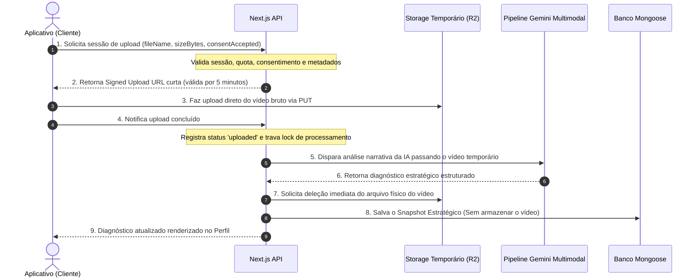

# Estratégia de Upload e Armazenamento Temporário de Vídeo

## 📋 Introdução & Objetivo
O Perfil Estratégico da Data2Content (D2C) atua como o **diagnóstico vivo do creator**. Cada vídeo analisado enriquece e atualiza esse perfil com novos aprendizados, signals e padrões narrativos.

Para habilitar a análise de vídeos reais no futuro mantendo **privacidade máxima, segurança e economia de custos**, estabelecemos uma arquitetura baseada em **Upload Temporário com Descarte Seguro**. Sob esta abordagem, o vídeo bruto funciona apenas como uma pauta efêmera de processamento: **o vídeo é carregado temporariamente, analisado pelo modelo multimodal, e deletado imediatamente após a conclusão da análise estratégica.**

---

## 🔒 Princípios de Segurança (O que nunca salvar)
Para evitar riscos jurídicos, de privacidade e custos astronômicos de armazenamento, as seguintes restrições são absolutas:
1. **Sem Histórico Visual de Vídeos**: A D2C **nunca** exibirá uma galeria de vídeos enviados, lista de vídeos analisados ou player para assistir vídeos antigos. O único artefato permanente é o diagnóstico atualizado no Perfil.
2. **Descarte Imediato**: Todo arquivo físico enviado deve ser excluído assim que o processamento do pipeline da IA for concluído (seja em caso de sucesso ou de falha irrecuperável).
3. **Persistência Proibida**:
   - Nunca salvar o vídeo bruto ou compactado de forma permanente.
   - Nunca persistir assinaturas de URLs (signed URLs) ou tokens temporários no banco de dados.
   - Nunca expor URLs de buckets públicos.
   - Nunca salvar ou reter imagens de thumbnails do vídeo.

---

## 📊 Limites de Arquivo & Quotas (Políticas de Quota)

A política de limites visa assegurar excelente desempenho na rede e evitar abusos maliciosos:

| Métrica | Limite Padrão | Justificativa de Produto / Técnica |
| :--- | :--- | :--- |
| **maxFileSizeBytes** | 100 MB | Suficiente para vídeos comprimidos de celular. Evita consumo excessivo de banda de upload no servidor. |
| **maxDurationSeconds** | 300s (5 min) | Cobre com folga o limite padrão de vídeos verticais (Reels/Shorts/TikTok), mantendo foco em micro-narrativas. |
| **retentionTtlMinutes** | 60 minutos | Tempo ótimo para processamento assíncrono e resiliência na fila sem manter mídias em repouso por mais tempo que o necessário. |

---

## 🛡️ Validação Rigorosa de Metadados & Arquivos
Antes que qualquer requisição de upload seja autorizada ou processada pelo storage provider:
- **MimeType & Extensões Coerentes**: Permitidos apenas `video/mp4`, `video/quicktime` (MOV) e `video/webm`.
- **Prevenção contra Executáveis**: Bloqueio ativo contra dupla extensão (ex: `video.mp4.exe`) e assinaturas restritas de extensões como `.exe`, `.sh`, `.bat`, `.js`, etc.
- **Sanitização estrita de Nomes**: Eliminação de caracteres de escape de diretórios (ex: `../`), substituição de espaços por sublinhados (`_`) e restrição a caracteres seguros (`a-zA-Z0-9.\-_`).
- **Bloqueio de Injeções**: Rejeição imediata de strings em Base64 ou URLs externas passadas como nome do arquivo.

---

## ⚙️ Feature Flags Propostas

Para garantir a ativação gradual, o controle do sistema de upload e storage temporário será regido pelas seguintes flags:

```bash
# Habilita o upload real e bypassa o mock local
VIDEO_NARRATIVE_REAL_UPLOAD_ENABLED=false

# Define o provedor ativo ('disabled', 'local_mock', 's3', 'r2', 'gcs', 'cloudinary')
VIDEO_NARRATIVE_TEMP_STORAGE_PROVIDER=disabled

# Define o tamanho máximo de upload permitido por payload (em MB)
VIDEO_NARRATIVE_TEMP_UPLOAD_MAX_MB=100

# Tempo limite para descarte forçado do arquivo temporário
VIDEO_NARRATIVE_TEMP_UPLOAD_TTL_MINUTES=60
```

---

## 🌩️ Provedores de Storage Avaliados (Abstração)

Embora a implementação atual mantenha o provider como `disabled`, projetamos a interface para ser compatível com os principais players do mercado:

1. **Cloudflare R2**:
   - *Prós*: Sem tarifas de egress (saída de dados), o que zera o custo de leitura de grandes volumes de vídeo pelas APIs de IA. Suporta API S3 perfeitamente.
   - *Recomendação*: **Candidato preferencial** devido ao custo-benefício de transferência e compatibilidade nativa com Next.js.
2. **AWS S3**:
   - *Prós*: Robustez, SLA extremamente alto e ecossistema maduro.
   - *Contras*: Custos de transferência e egress significativamente elevados para arquivos de vídeo.
3. **Google Cloud Storage (GCS)**:
   - *Prós*: Excelente latência em infraestruturas hospedadas no Google Cloud e integração de alta performance com a suíte Gemini API (Vertex AI).
4. **Cloudinary**:
   - *Prós*: Ferramentas automáticas de compressão e conversão de vídeo na borda.
   - *Contras*: Limites de créditos e custo por transformação muito altos para pipelines puramente estratégicos/estatísticos.

---

## 🔄 Fluxo de Processamento Futuro (Ciclo de Vida)



---

## ⚖️ Consentimento Ativo do Creator
O envio só é habilitado após o consentimento explícito em uma caixa de diálogo antes de selecionar a mídia. O consentimento contém:
- **Finalidade**: `"video_narrative_analysis"` para diagnóstico no perfil estratégico.
- **Transparência**: Alerta claro de que o vídeo físico **não é mantido** e será permanentemente descartado em até 1 hora ou imediatamente após o processamento.

---

## 🚀 Fase MM60 — API de Sessão Temporária de Upload (Modo Mock/Disabled)
A primeira materialização física deste plano é a API `/api/dashboard/mobile-strategic-profile/upload-session`.
* **Segurança do Endpoint**: Exige sessão real autenticada e feature flags.
* **Modo Mock Seguro**: Retorna o status `mock_session_created` sem expor nenhuma `uploadUrl` ou token físico quando o payload é aprovado pelo validador do MM59.
* **Futura Rota Real**: Quando a feature flag `VIDEO_NARRATIVE_REAL_UPLOAD_ENABLED` for ativada (após auditoria final de custos e segurança), o endpoint será expandido para assinar as URLs curtas do provedor sem alterar o contrato de metadados estabelecido aqui.

## Fase MM61 — UI Metadata Dry-Run E Consentimento

MM61 conecta a rota real do Perfil Estratégico mobile ao endpoint de sessão temporária em modo seco:

- a UI permite seleção local de vídeo apenas para capturar `name`, `type` e `size`;
- o consentimento curto usa a versão `video_narrative_upload_consent_v1`;
- o arquivo não é enviado, não é lido como bytes, não vira preview e não é salvo;
- a resposta `mock_session_created` apenas libera o caminho para a análise mock já existente.

Próximos passos para provider real permanecem separados: escolher storage, assinar URL curta, implementar upload direto, confirmar processamento, deletar o arquivo e auditar cleanup. Nenhum desses passos é liberado por MM61.

## Fase MM62 — Provider Abstraction

MM62 adiciona a camada server-side que decide qual provider de storage temporário seria usado, sem habilitar storage real.

- `disabled`: retorno seguro para qualquer configuração sem provider mock ou com blockers.
- `mock`: cria sessão `mock_session_created` com TTL, retenção e flags de descarte, sem URL ou chave de storage.
- `r2_planned`, `s3_planned`, `gcs_planned`, `cloudinary_planned`: modos documentados para futuro, sempre disabled nesta build.
- Validação de env: lê sessão habilitada, max MB, TTL de retenção, TTL de signed URL e provider planejado, mas bloqueia `VIDEO_NARRATIVE_REAL_UPLOAD_ENABLED=true`.

Próximos passos antes de signed URL real:

- definir allowlist exata de provider e ambiente;
- validar credenciais sem logar secrets;
- adicionar assinatura curta em provider isolado;
- testar upload direto sem passar bytes pelo servidor da aplicação;
- auditar cleanup, expiração e remoção pós-processamento.

## Fase MM63 — Signed Upload Allowlist

MM63 adiciona o primeiro caminho de signed upload session server-side para R2/S3-compatible, ainda sem upload real no client:

- feature flags obrigatórias: `VIDEO_NARRATIVE_TEMP_UPLOAD_SESSION_ENABLED=1`, `VIDEO_NARRATIVE_REAL_UPLOAD_ENABLED=true`, `VIDEO_NARRATIVE_TEMP_STORAGE_PROVIDER=r2|aws_s3` e `VIDEO_NARRATIVE_SIGNED_UPLOAD_ALLOWLIST_ENABLED=1`;
- allowlist server-side por admin/dev, email ou userId via env;
- validação de env obrigatória para bucket, região, endpoint, TTL curto de signed URL e TTL de retenção;
- `objectKey` gerado sem nome original, email, handle, espaços ou dados sensíveis;
- `uploadUrl` só aparece no resultado de sessão signed allowlist e nunca é persistida;
- não há bucket secreto, access key, secret key, account id ou token retornado fora da URL assinada.

Como o repo ainda não possui SDK S3/R2 adequado instalado, a assinatura real fica isolada em um signer server-side injetável/testável. Próximo passo para upload direto: escolher/adicionar o SDK server-only, implementar o signer S3-compatible, manter allowlist por ambiente e só depois criar o client direct upload em PR separado.
